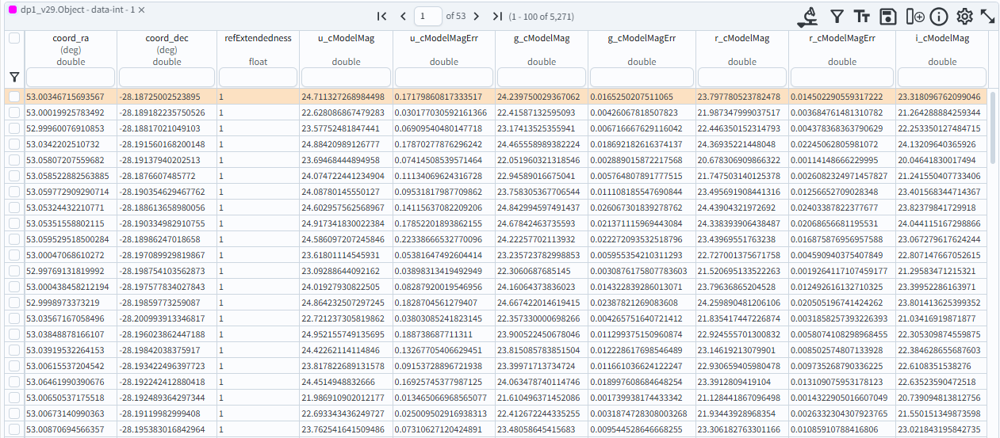

.. _portal-103-2:

#################################################
103.2 How to convert fluxes to magnitudes with ADQL
#################################################

For the Portal Aspect of the Rubin Science Platform at data.lsst.cloud.

**Data Release:** DP1

**Last verified to run:** 2025-05-30

**Learning objective:** This tutorial demonstrates how to convert fluxes to magnitudes using a special ADQL function.

**LSST data products:** dp0.2 catalogs

**Credit:** Originally developed by Greg Madejski and Melissa Graham. Please consider acknowledging them if this tutorial is used for the preparation of journal articles, software releases, or other tutorials.

**Get Support:** Everyone is encouraged to ask questions or raise issues in the `Support Category <https://community.lsst.org/c/support/6>`_ of the Rubin Community Forum. Rubin staff will respond to all questions posted there.

**Warning!** Fluxes measured in difference images can be negative.
Negative fluxes should not be converted to magnitudes using this special ADQL function.

**1. Go to the DP0.2 catalog ADQL interface.**
Navigate to the Portal's DP0.2 Catalogs tab and switch to the ADQL interface.

**2. To return magnitudes** use the ``scisql_nanojanskyToAbMag()`` function.
This function will convert a flux value with the units of nanoJanskies (nJy) into an AB magnitude.
The conversion is :math:`m = -2.5 log(f) + 31.4`, where :math:`m` is magnitude and :math:`f` is flux.

.. code-block:: SQL

  SELECT coord_dec, coord_ra, detect_isPrimary, refExtendedness, 
         scisql_nanojanskyToAbMag(u_cModelFlux) AS u_cModelMag, 
         scisql_nanojanskyToAbMag(g_cModelFlux) AS g_cModelMag, 
         scisql_nanojanskyToAbMag(r_cModelFlux) AS r_cModelMag, 
         scisql_nanojanskyToAbMag(i_cModelFlux) AS i_cModelMag, 
         scisql_nanojanskyToAbMag(z_cModelFlux) AS z_cModelMag, 
         scisql_nanojanskyToAbMag(y_cModelFlux) AS y_cModelMag
  FROM dp02_dc2_catalogs.Object 
  WHERE CONTAINS(POINT('ICRS', coord_ra, coord_dec), 
        CIRCLE('ICRS', 62, -37, 0.167)) =1 
        AND (detect_isPrimary =1 AND refExtendedness =1 
             AND u_cModelFlux >360 AND g_cModelFlux >360 
             AND r_cModelFlux >360 AND i_cModelFlux >360 
             AND z_cModelFlux >360 AND y_cModelFlux >360)

**3. To return magnitude errors** use the ``scisql_nanojanskyToAbMagSigma()`` function.
This funtion will convert the corresponding flux errors, in nJy, into AB magnitude errors.

.. code-block:: SQL

  SELECT coord_dec, coord_ra, detect_isPrimary, refExtendedness, 
         scisql_nanojanskyToAbMag(u_cModelFlux) AS u_cModelMag, 
         scisql_nanojanskyToAbMagSigma(u_cModelFlux, u_cModelFluxErr) AS u_cModelMagErr, 
         scisql_nanojanskyToAbMag(g_cModelFlux) AS g_cModelMag, 
         scisql_nanojanskyToAbMagSigma(g_cModelFlux, g_cModelFluxErr) AS g_cModelMagErr, 
         scisql_nanojanskyToAbMag(r_cModelFlux) AS r_cModelMag, 
         scisql_nanojanskyToAbMagSigma(r_cModelFlux, r_cModelFluxErr) AS r_cModelMagErr, 
         scisql_nanojanskyToAbMag(i_cModelFlux) AS i_cModelMag, 
         scisql_nanojanskyToAbMagSigma(i_cModelFlux, i_cModelFluxErr) AS i_cModelMagErr, 
         scisql_nanojanskyToAbMag(z_cModelFlux) AS z_cModelMag, 
         scisql_nanojanskyToAbMagSigma(z_cModelFlux, z_cModelFluxErr) AS z_cModelMagErr, 
         scisql_nanojanskyToAbMag(y_cModelFlux) AS y_cModelMag,
         scisql_nanojanskyToAbMagSigma(y_cModelFlux, y_cModelFluxErr) AS y_cModelMagErr 
  FROM dp02_dc2_catalogs.Object 
  WHERE CONTAINS(POINT('ICRS', coord_ra, coord_dec), 
        CIRCLE('ICRS', 62, -37, 0.167)) =1 
        AND (detect_isPrimary =1 AND refExtendedness =1 
             AND u_cModelFlux >360 AND g_cModelFlux >360 
             AND r_cModelFlux >360 AND i_cModelFlux >360 
             AND z_cModelFlux >360 AND y_cModelFlux >360)

**4. Notice the query constraints** on coordinate, extendedness, flux, and the ``detect_isPrimary`` flag are set in order to
retrieve a small sample of point-like objects (stars) brighter than 25th magnitude (as in preceding tutorials).

**5. View the results.**
Figure 1 shows the table panel in the Results tab for the query above.
Notice that there are no flux columns because they were retrieved ``AS`` magnitudes,
and the columns have been renamed as specified in the ADQL statement.

    Figure 1: The table panel in the Results tab for the query above shows no flux columns, but magnitude and magnitude error columns.

**Note.** For a demonstration of how to convert fluxes to magnitudes after a query is executed,
see the tutorial on how to use the results table data.

