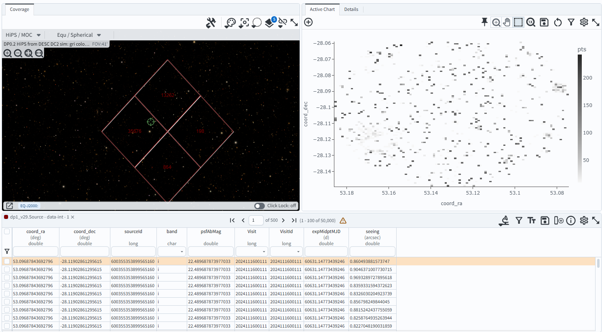
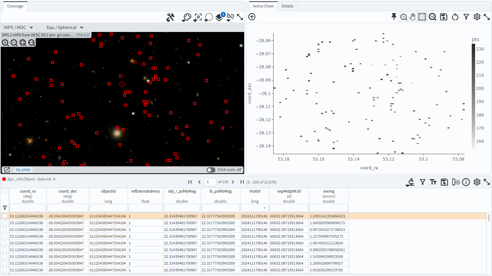

.. _portal-103-3:

##################################
103.2 How to join tables with ADQL
##################################

For the Portal Aspect of the Rubin Science Platform at data.lsst.cloud.

**Data Release:** DP1

**Last verified to run:** 2025-05-30

**Learning objective:** This tutorial demonstrates how to join tables from a given catalog and retrieve results with ADQL.

**LSST data products:** dp0.2 catalogs

**Credit:** Originally developed by Greg Madejski and Melissa Graham. Please consider acknowledging them if this tutorial is used for the preparation of journal articles, software releases, or other tutorials.

**Get Support:** Everyone is encouraged to ask questions or raise issues in the `Support Category <https://community.lsst.org/c/support/6>`_ of the Rubin Community Forum. Rubin staff will respond to all questions posted there.

**Warning!**
Not all tables can be joined.
Two tables must have a column in common in order to be joined.

**1. Go to the DP0.2 catalog ADQL interface.**
Navigate to the Portal's DP0.2 Catalogs tab and switch to the ADQL interface.

**2. The ADQL components of a JOIN...ON statment.**
The generic example below illustrates a common join scenario.
Four columns ("ra", "dec", "colA", and "colB") are selected from "table1", for objects
where their coordinates are within 0.05 degrees of RA=62 deg, Dec=-37 deg.
The results from "table1" are joined with "table2" on their matching column, "colID".
Two columns are selected from "table2" ("colX" and "colY").

.. code-block:: SQL

   SELECT tab1.ra, tab1.dec, tab1.colA, tab1.colB, tab2.colX, tab2.colY 
   FROM table1 AS tab1 
   JOIN table2 AS tab2 
   ON tab1.colID = tab2.colID 
   WHERE CONTAINS(POINT('ICRS', tab1.ra, tab1.dec),
         CIRCLE('ICRS', 62.0, -37, 0.05)) = 1

   **The above cannot be executed and is a generic demonstration only.**

**3. Execute a two-table join.**
The ``Source`` table (detections in individual processed visit images) can be joined with the
``CcdVisit`` table (metadata about individual visits) using a shared column, ``ccdVisitId``,
which uniquely identifies an LSST visit.
Constraints can be applied on columns from either or both tables.
Spatial constraints are applied to the ``FROM`` table, not the ``JOIN`` table.

.. code-block:: SQL

   SELECT src.coord_ra, src.coord_dec, src.sourceId, src.band, 
          scisql_nanojanskyToAbMag(src.psfFlux) AS psfAbMag,
          src.ccdVisitId, cv.ccdVisitId, 
          cv.expMidptMJD, cv.seeing
   FROM dp02_dc2_catalogs.Source AS src
   JOIN dp02_dc2_catalogs.CcdVisit AS cv
   ON src.ccdVisitId = cv.ccdVisitId
   WHERE CONTAINS(POINT('ICRS', src.coord_ra, src.coord_dec),
         CIRCLE('ICRS', 62.0, -37, 0.05)) = 1 
         AND cv.expMidptMJD > 60925 AND cv.expMidptMJD < 60955
         AND src.band = 'i' 

**4. Review the two-table join results.**
Notice that this join is not one-to-one: there are multiple individual sources returned that are matched to the same visit.
In other words, there are multiple rows from the ``Source`` table joined with a given row from the ``CcdVisit`` table.
If multiple tabs are present above the upper left panel in the default Results tab layout, click the "Coverage" tab to display the coverage chart.

    Figure 1: The Portal Results tab with a default layout for the data returned from the two-table join query.

**5. Execute a three-table join.**
The ``Object`` table (photometry in the deepCoadd images) can be joined with the
``ForcedSource`` table (photometry in individual processed visit images) using their shared ``objectId`` column.
The ``ForcedSource`` table can be joined with the ``CcdVisit`` table using ``ccdVisitId``.
Constraints can be applied on columns from any or all tables.

.. code-block:: SQL

   SELECT obj.coord_ra, obj.coord_dec, obj.objectId, obj.refExtendedness, 
          scisql_nanojanskyToAbMag(i_psfFlux) AS obj_i_psfAbMag,
          scisql_nanojanskyToAbMag(fs.psfFlux) AS fs_psfAbMag,
          cv.ccdVisitId, cv.expMidptMJD, cv.seeing
   FROM dp02_dc2_catalogs.Object AS obj 
   JOIN dp02_dc2_catalogs.ForcedSource AS fs 
   ON obj.objectId = fs.objectId
   JOIN dp02_dc2_catalogs.CcdVisit AS cv
   ON fs.ccdVisitId = cv.ccdVisitId
   WHERE CONTAINS(POINT('ICRS', obj.coord_ra, obj.coord_dec),
         CIRCLE('ICRS', 62.0, -37, 0.05)) = 1 
         AND obj.refExtendedness = 1 
         AND obj.i_psfFlux > 3600 
         AND cv.expMidptMJD > 60925 AND cv.expMidptMJD < 60955
         AND fs.band = 'i' 

**6. Review the three-table join results.**
The join of ``Object`` to ``ForcedSource`` is one-to-many, and the join of ``ForcedSource`` to ``CcdVisit`` is many-to-one.
The default Results tab will display an empty panel instead of the coverage chart. To view the coverage chart, click the
"Coverage" tab at the top of the upper left panel.

    Figure 2: The Portal Results tab with the layout displaying the activated coverage chart for the data returned from the three-table join query.

**7. Find more join examples.**
Visit the /data-access-analysis-tools/adql-recipes page for more examples of table joins.
Visit the `DP0.2 schema browser <https://sdm-schemas.lsst.io/dp02.html>`_ to see which tables have columns in common.

