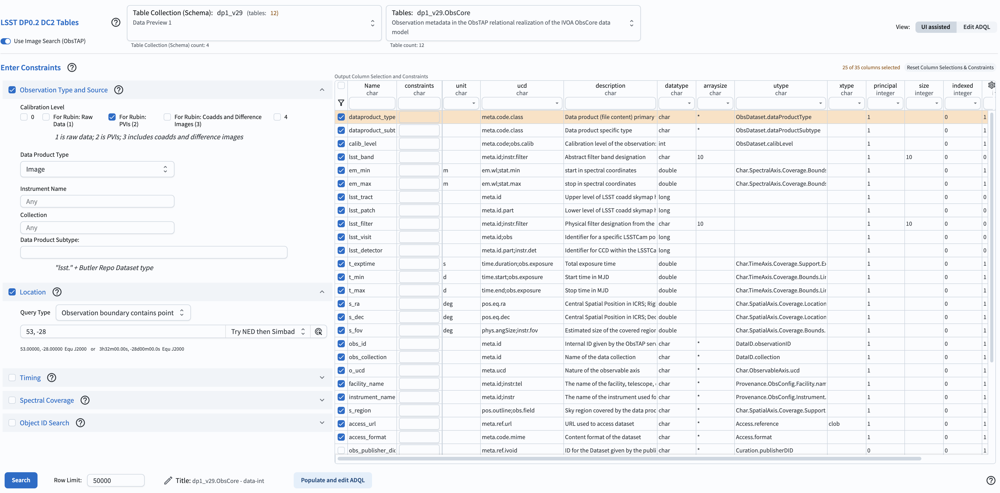
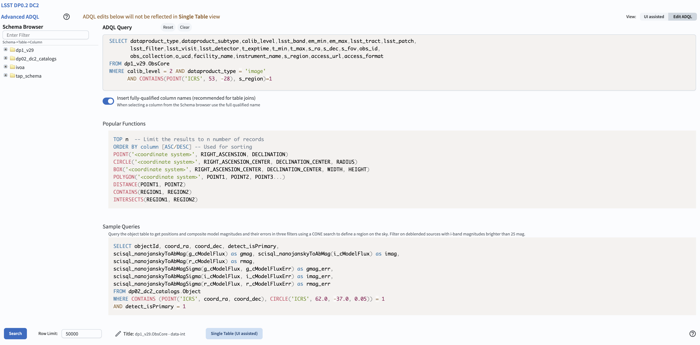
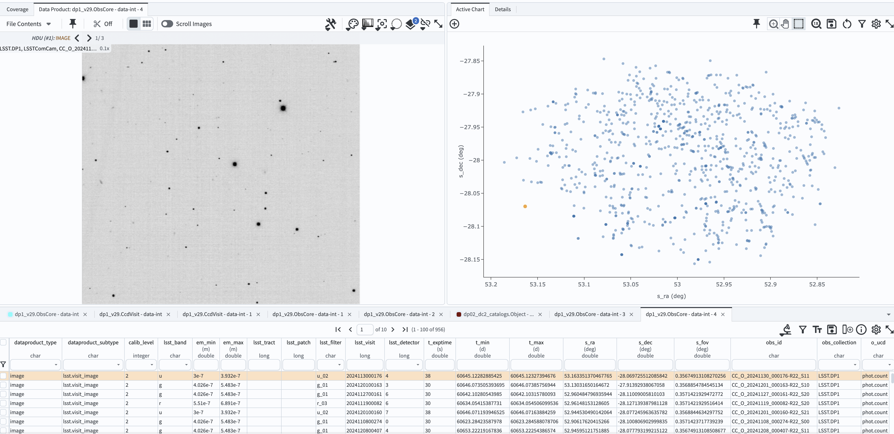

.. _portal-103-4:

#############################################
103.4. How to query / examine images via ADQL
#############################################

For the Portal Aspect of the Rubin Science Platform at data.lsst.cloud.

**Data Release:** DP1

**Last verified to run:** 2025-06-11

**Learning objective:** This tutorial demonstrates how to query, extract, and examine Rubin images via an `Astronomy Data Query Language (ADQL) <https://www.ivoa.net/documents/latest/ADQL.html>`_ query in the Portal Aspect of the Rubin Science Platform.

**LSST data products:** dp1 catalogs and images

**Credit:** Originally developed by Greg Madejski and Melissa Graham. Please consider acknowledging them if this tutorial is used for the preparation of journal articles, software releases, or other tutorials.

**Get Support:** Everyone is encouraged to ask questions or raise issues in the `Support Category <https://community.lsst.org/c/support/6>`_ of the Rubin Community Forum. Rubin staff will respond to all questions posted there.

**1. Rationale for preparing the ADQL query using UI aspect of the Portal.**
While it is possible to enter the ADQL query directly into the ADQL aspect of the Portal, if the goal is to query and examine images containing a given location - using the UI aspect to create the ADQL query is probably simpler as it involves only a few steps.

**2.  Prepare the ADQL query using the UI aspect.**
Navigate to the "DP0.2 Catalogs" tab in the Portal UI.
In "Table Collection (Schema)" select "dp1_v29" and in the "Tables" select "dp1_v29.ObsCore" table.
Leave the blue checkmarks in the "Output Column Selection and Constrants" as defaulted.
Under "Enter Constraints" check "Location" and enter ``53.0, -28.0``.
For "Radius" enter 3 arc minutes.
In "Observation Type and Source" check "PVI(2)" - this selects the individual calibrated exposures (Processed Visit Images).
Leave "Temporal" and Object ID Search" unchecked, but of course it is possible to restrict the search to observations conducted durubng specific times.

    Figure 1: The Portal UI set up to search for images corresponding to the constraints in the "Enter Constraints" area.

**3.  Convert the parameters selected via UI to an ADQL query**
Click on the box "Populate and edit ADQL".
This will result in the ADQL aspect of the Portal, with the UI query above converted to an ADQL query.
Of course you can enter the query manually (or edit it) if needed.

    Figure 2: The Portal ADQL aspect, illustrating the query converted from UI to ADQL and corresponding to the constraints entered in the UI aspect.

**4.  Examine the resulting image(s)**
Click on the "Search" button.  
This will result in the image corresponding to the first entry in the table on the upper left, and the scatter point of telescope pointings on the upper right, as shown in the scfreenshot below.
Other images can be examined by clicking other entries in the table on the bottom.

    Figure 3: The screenshot of the image, the scatter plot, and the table resulting from executing the ADQL query in Figure 2.

