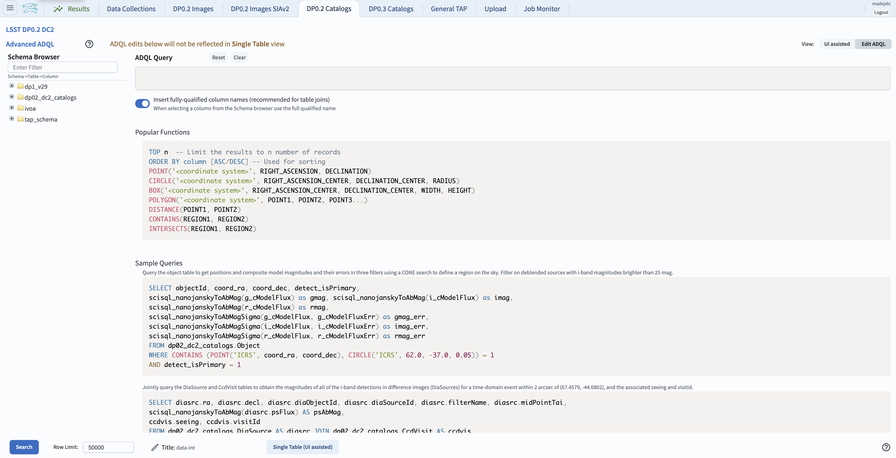

.. _portal-102-1:

#############################################
103.4. How to query / examine images via ADQL
#############################################

For the Portal Aspect of the Rubin Science Platform at data.lsst.cloud.

**Data Release:** DP1

**Last verified to run:** 2025-06-11

**Learning objective:** This tutorial demonstrates how to query, extract, and examine Rubin images via an `Astronomy Data Query Language (ADQL) <https://www.ivoa.net/documents/latest/ADQL.html>`_ query in the Portal Aspect of the Rubin Science Platform.

**LSST data products:** dp1 catalogs and images

**Credit:** Originally developed by Greg Madejski and Melissa Graham. Please consider acknowledging them if this tutorial is used for the preparation of journal articles, software releases, or other tutorials.

**Get Support:** Everyone is encouraged to ask questions or raise issues in the `Support Category <https://community.lsst.org/c/support/6>`_ of the Rubin Community Forum. Rubin staff will respond to all questions posted there.

**1. Rationale for preparing the ADQL query using UI aspect of the Portal.**
While it is possible to enter the ADQL query directly into the ADQL aspect of the Portal, if the goal is to query and examine images containing a given location - using the UI aspect to create the ADQL query is probably simpler as it involves only a few steps.  

**2.  Prepare the ADQL query using the UI aspect.**
Navigate to the "DP0.2 Catalogs" tab in the Portal UI.
In "Table Collection (Schema)" select "dp1_v29" and in the "Tables" select "dp1_v29.Object" table.
Specifically, in the "Output Column Selection and Constraints" check boxes by the rows for ``coord_dec, coord_ra, detect_isIsolated, u_cModelFlux, g_cModelFlux, r_cModelFlux, i_cModelFlux, z_cModelFlux, y_cModelFlux``.
For all flux rows, enter a constraint ``>360``.
For the "detect_isIsolated" enter ``=1``.
Under "Enter Constraints" check "Spatial" and enter ``53.0, -28.0``.
For "Radius" enter 3 arc minutes.
Leave "Temporal" and Object ID Search" unchecked.

    Figure 1: The Portal UI set up for a simple cone search query for bright objects in the selected region.

